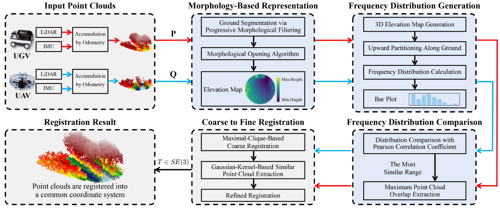

# MBR-PCR

## Introduction
[TII 2025] Morphology-Based Representation of Point Clouds and Real-Time Registration for Aerial–Ground Vehicles in Outdoor Scenarios

This article proposes a real-time point cloud registration method using a morphology-based representation that addresses the challenge of limited overlap between aerial–ground point clouds, enabling robust registration across diverse outdoor scenarios.

<div align="center">
    <div align="center">
        
    </div>
    <font>
    MBR-PCR Pipeline</font>
</div>

## Anaconda Environment Setup

Please use the following command for installation.

```bash
conda create -n MBR-PCR python==3.11.13
conda activate MBR-PCR
pip3 install open3d numpy faiss-cpu tqdm tyro scikit-image numba pybind11
pip3 install torch torchvision torchaudio --index-url https://download.pytorch.org/whl/cu118
cd bindings
python setup.py install
cd ..
cd utils/distributionSample
mkdir build
cd build
cmake ..
make
```

## Dataset
We put datasets in [Quark](https://pan.quark.cn/s/79eea2b948ea). Unzip the datasets (containing GrAco and CampHill) to Datasets. 'CampHill'/'GrAco' contain point features and point clouds. 'CampHill_json'/'GrAco_json' contain ground truth.

## How to Run

1. Choose Dataset or mode in line 215-216 of main.py
2. Then
```
python main.py
```
3. If you want to test your PCR method, replace your method with line 243 of main.py

# Acknowledgement
We acknowledge the authors of [TurboReg](https://github.com/Laka-3DV/TurboReg) and [GrAco](https://github.com/SYSU-RoboticsLab/GrAco) for their excellent works, which have been used as a starting point for this project.
